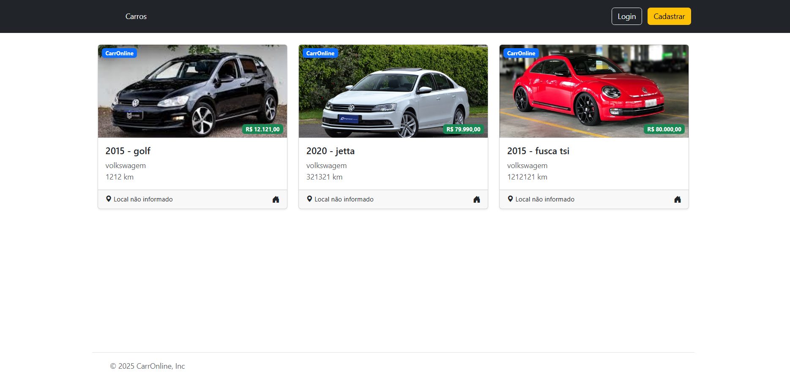

# 🚗 CarrOnline

CarrOnline é uma plataforma simples para exibição de veículos à venda. Desenvolvido como projeto de demonstração, ele lista veículos com informações como modelo, marca, ano, quilometragem, e valor.



## 🔧 Funcionalidades

- Listagem de veículos com imagem, marca, modelo e preço.
- Interface responsiva e intuitiva.
- Botões de login e cadastro.
- Informação de localização (mesmo que "não informada").

## 🛠️ Tecnologias utilizadas

- HTML
- CSS
- JavaScript (provavelmente)
- Frameworks e bibliotecas (ex: React, Bootstrap — dependendo do projeto real)

## 🚀 Como rodar o projeto

1. Clone este repositório:
   ```bash
   git clone https://github.com/seu-usuario/carronline.git
   cd carronline
   ```

2. Instale as dependências (caso use npm/yarn):
   ```bash
   npm install
   ```

3. Crie um storage para as imagens
    ```bash
   php artisan storage:link
    ```
4. Inicie o projeto:
   ```bash
   npm start
   ```


